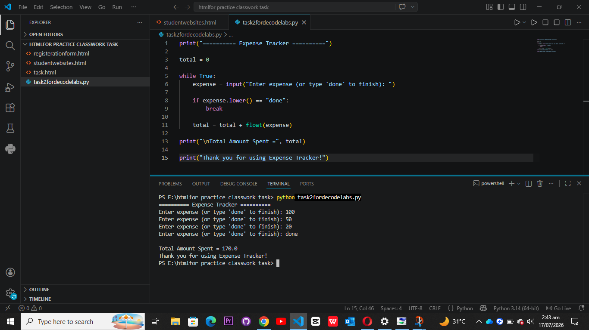

# Expense Tracker

## Description
This is a simple Python Expense Tracker project.

The program allows the user to:
- Enter multiple expenses.
- Type **done** to stop entering expenses.
- Calculate and display the total amount spent.

## Python Concepts Used
- Variables
- While Loop
- if Statement
- User Input
- Accumulator
- float() Function

## Sample Output

```
========== Expense Tracker ==========

Enter expense (or type 'done' to finish): 100
Enter expense (or type 'done' to finish): 50
Enter expense (or type 'done' to finish): 20
Enter expense (or type 'done' to finish): done

Total Amount Spent = 170.0

Thank you for using Expense Tracker!
```

## Output Screenshot


